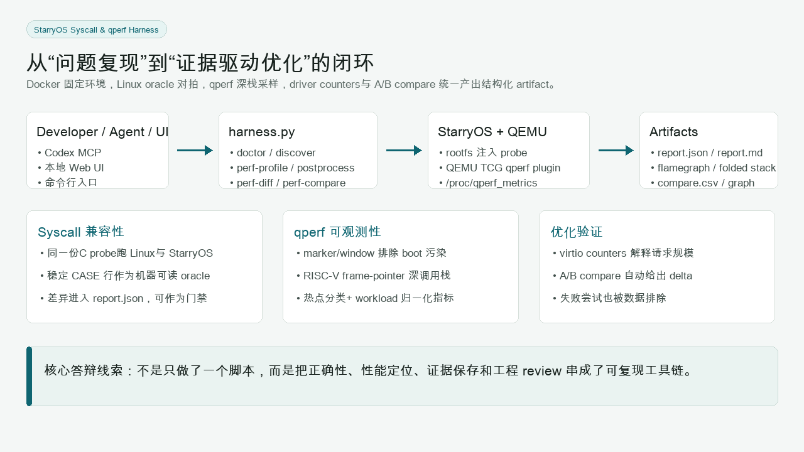
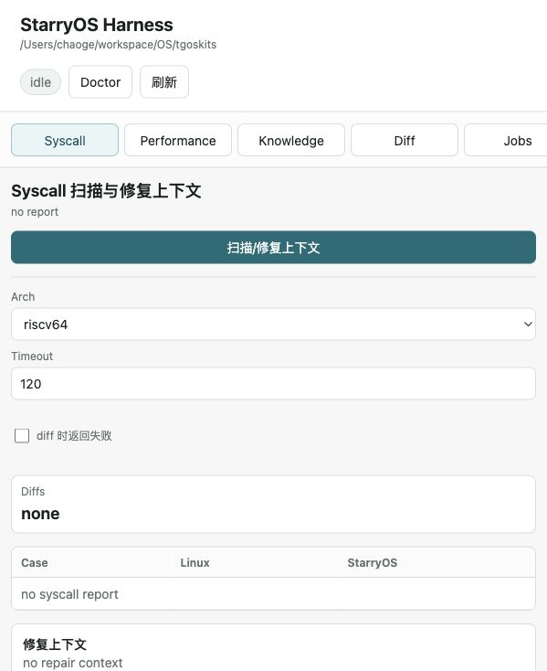
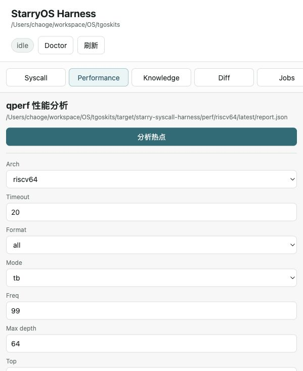
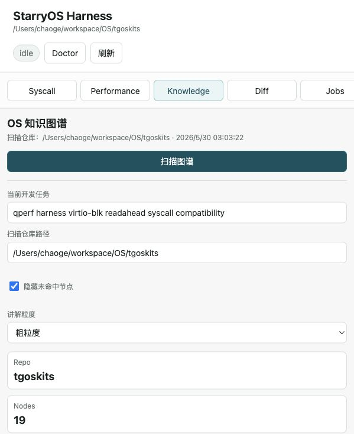

# Big Lab B Final Report Archive

本仓库归档 Big Lab B 最终报告、Task1-5 细粒度实验报告和答辩视觉素材。主目录为 [`archieve/`](archieve/)，其中既有总结报告和最终 PPT 保持原样；新增 Task 报告用于把分散在 tgoskits 仓库中的阶段性报告、qperf 记录、harness 文档和答辩材料合并成可评阅的结构。

## 结论概览

本次 Big Lab B 的主线是从 OS 基础训练走向可复现的 StarryOS 工程闭环：

```text
ArceOS tutorial 分层训练
  -> StarryOS syscall Linux 兼容性修复
  -> BusyBox / Codex CLI 真实应用兼容性验证
  -> qperf guest kernel 性能分析与 virtio-blk 优化
  -> OScope harness：CLI + UI + MCP + Skill + Knowledge Graph
```

最终报告材料分为两层：

| 层次 | 文件 | 说明 |
| --- | --- | --- |
| 总结材料 | [`archieve/cg24_thu_big_lab_b_report.md`](archieve/cg24_thu_big_lab_b_report.md) | 既有总结报告，保留原貌 |
| 展示材料 | [`archieve/final_version.pptx`](archieve/final_version.pptx) | 既有最终答辩 PPT，保留原貌 |
| 细粒度报告 | [`archieve/Task1_arceos_tutorial_os_baseline.md`](archieve/Task1_arceos_tutorial_os_baseline.md) 到 [`archieve/Task5_oscope_harness_skill_mcp_delivery.md`](archieve/Task5_oscope_harness_skill_mcp_delivery.md) | 按 Task 重写、去重和补充证据 |
| 素材索引 | [`archieve/report_index.md`](archieve/report_index.md) | 说明所有源报告如何合并到 Task1-5 |
| 视觉素材 | [`archieve/assets/`](archieve/assets/) | qperf 火焰图、harness UI、架构图、A/B 指标截图 |

## 推荐阅读顺序

如果只需要快速了解最终成果：

1. 阅读 [`archieve/cg24_thu_big_lab_b_report.md`](archieve/cg24_thu_big_lab_b_report.md)。
2. 浏览 [`archieve/final_version.pptx`](archieve/final_version.pptx)。
3. 查看 [`archieve/Task4_qperf_tooling_and_virtio_optimization.md`](archieve/Task4_qperf_tooling_and_virtio_optimization.md) 中的 qperf A/B 数据。
4. 查看 [`archieve/Task5_oscope_harness_skill_mcp_delivery.md`](archieve/Task5_oscope_harness_skill_mcp_delivery.md) 中的 harness、MCP、UI 和 Skill 实现。

如果需要追溯所有素材来源：

1. 先读 [`archieve/report_index.md`](archieve/report_index.md)。
2. 再按 Task1-5 顺序阅读细粒度报告。
3. 对照 `assets/` 中的图像素材，理解 PPT 与报告中的证据链。

## Task 报告索引

| Task | 报告 | 重点内容 |
| --- | --- | --- |
| Task1 | [`Task1_arceos_tutorial_os_baseline.md`](archieve/Task1_arceos_tutorial_os_baseline.md) | ArceOS tutorial 五个 exercise；`no_std`、allocator、`mmap`、VFS/ramfs；后续实验的分层定位方法 |
| Task2 | [`Task2_syscall_compatibility_and_pipeline.md`](archieve/Task2_syscall_compatibility_and_pipeline.md) | Codex pipeline；`pipe2`、`preadv/pwritev2`、`ftruncate` 等 Linux ABI 修复；syscall harness 方法论 |
| Task3 | [`Task3_real_application_semantics_busybox_codex.md`](archieve/Task3_real_application_semantics_busybox_codex.md) | BusyBox applet、route netlink、procfs、packet socket；Codex CLI 触发的 poll/epoll、getcwd、TCP keepalive、zombie 与 tmpfs failure path |
| Task4 | [`Task4_qperf_tooling_and_virtio_optimization.md`](archieve/Task4_qperf_tooling_and_virtio_optimization.md) | `cargo starry perf`、marker window、deep callchain、virtio counters、A/B compare；rsext4 readahead 带来约 25% 顺序读吞吐提升 |
| Task5 | [`Task5_oscope_harness_skill_mcp_delivery.md`](archieve/Task5_oscope_harness_skill_mcp_delivery.md) | OScope harness、Codex Skill、MCP tools、Web UI、Knowledge Graph、本机 no-Docker 运行和交付边界 |

## 关键实验结果

| 方向 | 结果 |
| --- | --- |
| Task1 OS 基础训练 | 完成 `printcolor`、`hashmap`、`altalloc`、`sysmap`、`ramfs-rename`，建立后续定位 syscall/VFS/内存问题的方法 |
| Syscall 兼容性 | 修复 invalid flags、raw ABI 参数槽位、errno 优先级、iovec 边界和 fd 权限等 Linux 可观察语义 |
| 真实应用兼容性 | 从 BusyBox 和 Codex CLI 的真实失败路径反推 procfs、netlink、packet socket、poll/epoll、getcwd、TCP keepalive、zombie 等内核缺口 |
| qperf 工具链 | 从 leaf-only 火焰图升级到 marker window、deep callchain、virtio-aware counters、工程热点分类和 A/B compare |
| virtio-blk 优化 | qperf 定位大量 4 KiB 同步小 I/O；direct-only 方案退化；rsext4 readahead 使顺序读吞吐提升约 25.33%，blk read request 数下降约 84.51% |
| OScope harness | 将 syscall 对拍、qperf profile、UI、MCP、Codex Skill 和 Knowledge Graph 组合为可复用的 StarryOS 工程平台 |

## 视觉素材预览

### qperf 证据链


### OScope Harness









## 目录结构

```text
.
├── README.md
└── archieve
    ├── cg24_thu_big_lab_b_report.md
    ├── final_version.pptx
    ├── report_index.md
    ├── Task1_arceos_tutorial_os_baseline.md
    ├── Task2_syscall_compatibility_and_pipeline.md
    ├── Task3_real_application_semantics_busybox_codex.md
    ├── Task4_qperf_tooling_and_virtio_optimization.md
    ├── Task5_oscope_harness_skill_mcp_delivery.md
    └── assets
        ├── 01_qperf_baseline_fullstack.png
        ├── 02_qperf_readahead_fullstack.png
        ├── 03_qperf_blk_focus_flamegraph.png
        ├── 04_harness_ui_syscall.png
        ├── 05_harness_ui_performance.png
        ├── 06_harness_ui_knowledge_graph.png
        ├── 07_harness_architecture.png
        ├── 08_ab_compare_metrics.png
        └── 09_key_code_snippets.png
```

## 归档说明

本仓库中的 Task1-5 报告来自对 tgoskits 当前仓库内报告材料的合并、去重和精细化重写。已保留的总结报告和最终 PPT 不做内容改写，只作为最终总览材料归档。

归档时做过以下检查：

- `archieve/cg24_thu_big_lab_b_report.md` 保持原文件内容。
- `archieve/final_version.pptx` 保持原文件内容。
- `archieve/*.md` 中的本地图片链接均可在仓库内解析。
- `.DS_Store` 未纳入提交。
- `archieve/assets/` 图片来自 tgoskits 的 `final_pre/ppt_assets/`。

## 文件命名说明

目录名沿用原始交付路径中的拼写 `archieve/`，未改为 `archive/`，以避免破坏既有路径和引用。
