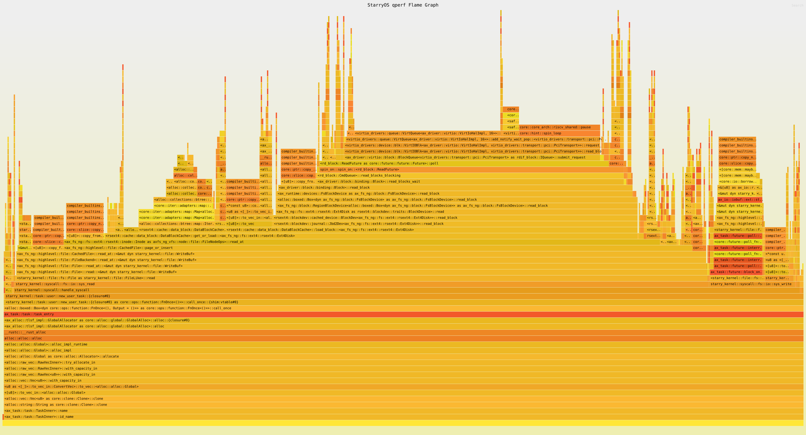
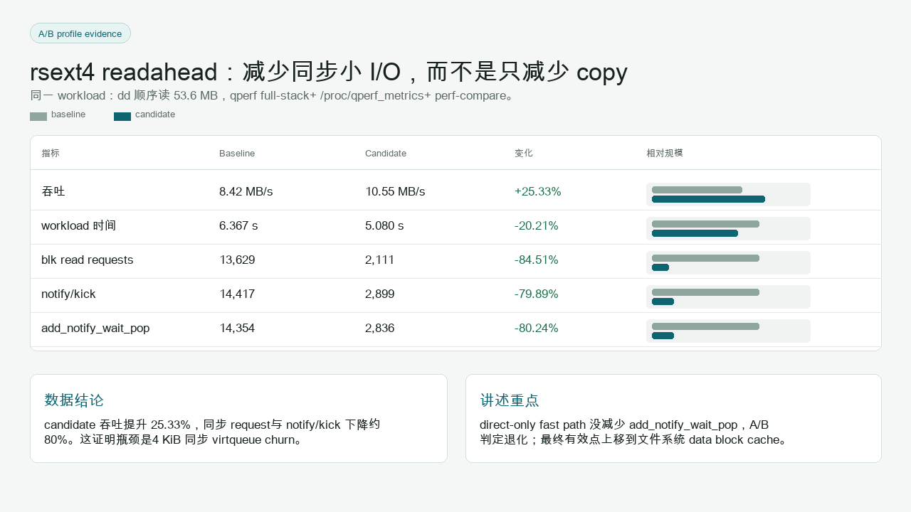
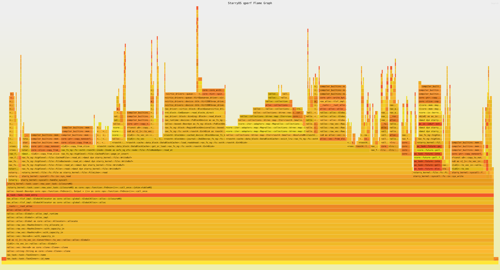

# Task4 细粒度实验报告：qperf 工具链与 VirtIO 性能优化

## 1. 任务定位

Task4 的目标是把 qperf 从“能出火焰图的采样器”升级为 StarryOS 的性能实验平台。最终能力包括：

- `cargo starry perf` 一键 profiling；
- QEMU TCG plugin 采集 guest kernel hotspot；
- marker/window 去除 boot 污染；
- workload stdout parser；
- `/proc/qperf_metrics` virtio-aware counters；
- 工程热点分类；
- 深调用栈火焰图；
- A/B compare；
- 基于证据的 virtio-blk readahead 优化。



## 2. 合并的源报告

| 源文件 | 本报告吸收内容 |
| --- | --- |
| `qperf_harness_work_summary.md` | qperf、harness、virtio 优化完整工作总结 |
| `docs/qperf-cargo-starry-integration-report.md` | `cargo starry perf` 与 `run --perf` 集成 |
| `docs/qperf-tooling-validation-report.md` | marker/window、counters、compare 验收 |
| `docs/qperf-callchain-validation-report.md` | 深调用栈验证数据 |
| `docs/qperf-current-blk-bottleneck-analysis.md` | blk baseline 瓶颈判断 |
| `docs/qperf-virtio-blk-deepstack-optimization-report.md` | readahead 最终 A/B 结果 |
| `docs/qperf-sampling-debug-notes.md` | 采样可信性和边界 |
| `docs/qperf-work-handoff.md` | 交付清单和后续建议 |

重复合并说明：多个 qperf 文档都解释了 TCG plugin、marker window 和 counters。本报告只保留最终一致设计，并把阶段性验证合并到一条“工具能力演进 -> 瓶颈定位 -> 优化验证”的链路中。

## 3. qperf 的定位与边界

qperf 是 QEMU TCG plugin，不是 host `perf`。它观察 guest 侧执行位置：

```text
QEMU TCG callbacks
  -> guest PC / SP / FP / callchain sample
  -> qperf.bin
  -> qperf-analyzer 结合 StarryOS kernel ELF 符号化
  -> stack.folded / flamegraph.svg / report.json
```

它不能直接提供：

- guest hardware cycles；
- guest cache misses；
- 精确 PMU retired instructions；
- 完整用户态 ELF symbol。

如果启用 host perf，测的是宿主机上的 QEMU 进程，包括 TCG、设备模拟和 plugin overhead，不能当作 guest PMU。

## 4. `cargo starry perf` 集成

原始 qperf 使用门槛较高，需要手写 harness 命令、QEMU plugin 参数和 analyzer 后处理。本轮将入口集成到 StarryOS workflow：

```bash
cargo starry perf --case boot
```

默认值：

| 参数 | 默认值 |
| --- | --- |
| arch | `riscv64` |
| case | `boot` |
| output | `target/qperf/<case>/perf/<arch>/latest/` |
| freq | `99` |
| max-depth | `128` |
| mode | `tb` |
| format | `all` |
| top | `80` |
| min-percent | `0.3` |
| host-time | 默认启用，除非 `--no-host-time` |

同时新增 `cargo starry run --perf` 作为 run 语义入口。带 `--perf` 时转换为同一套 `ArgsPerf`，避免复制 QEMU/qperf/analyzer 逻辑。

## 5. Marker Window：只分析真实 workload

性能实验的 workload 通常只占 QEMU 生命周期的一小段。如果从 boot 到 exit 全程采样，PCI probe、rootfs 初始化、shell 启动都会污染数据面结论。

本轮引入 guest stdout marker：

```bash
echo QPERF_BEGIN:blk-read
dd if=/usr/bin/lto-dump of=/dev/null bs=64k
echo QPERF_END:blk-read
```

harness 记录：

| 字段 | 含义 |
| --- | --- |
| `start_time` | marker 开始时间 |
| `stop_time` | marker 结束时间 |
| `duration_sec` | workload window 持续时间 |
| `boot_samples_excluded` | boot 阶段排除样本 |
| `post_window_samples_excluded` | stop marker 后排除样本 |
| `truncated_by_timeout` | 是否被 timeout 截断 |
| `warnings` | marker 缺失、退出异常等告警 |

当前 window 是 raw sample timestamp 的后处理过滤，不是 plugin runtime pause/resume。报告中必须保留这个边界。

## 6. Workload Parser 与归一化指标

harness 从 guest stdout 解析 workload 输出：

| 输出类型 | 提取字段 |
| --- | --- |
| `dd` | bytes、elapsed seconds、reported rate、派生 B/s |
| `wget` | saved 状态、bytes、marker window 派生 elapsed/throughput |
| `QPERF_METRIC key=value` | 自定义 counters，进入 `report.json.workload_metrics.values` |

归一化指标进入 `report.json.normalized_metrics`：

| 指标 | 含义 |
| --- | --- |
| `workload_bytes` | 工作负载字节数 |
| `workload_elapsed_seconds` | 工作负载耗时 |
| `samples_per_MB` | 每 MB 样本数 |
| `host_elapsed_sec_per_MB` | 每 MB host wall time |
| `guest_instructions_per_MB` | 每 MB guest instruction 计数 |
| `guest_blocks_per_MB` | 每 MB executed block 计数 |
| `category_samples_per_MB` | 各工程类别每 MB 样本 |

这样 qperf 报告不再只是“某次采到多少样本”，而可以回答单位工作量开销。

## 7. Virtio-aware Counters

仅靠火焰图无法回答请求规模问题。例如一个 `dd bs=64k` 是否真的变成 64 KiB 级别请求，还是仍拆成大量 4 KiB 同步 I/O。

本轮新增默认关闭的 `qperf-metrics` feature，并通过 `/proc/qperf_metrics` 导出：

```bash
echo reset > /proc/qperf_metrics
cat /proc/qperf_metrics
```

关键 counters：

| 类别 | counter |
| --- | --- |
| virtqueue | `virtqueue_add_count`、`virtio_notify_kick_count`、`virtqueue_pop_complete_count`、`virtqueue_add_notify_wait_pop_count`、`virtqueue_depth_max` |
| virtio-blk | `virtio_blk_read_requests`、`virtio_blk_read_bytes`、`virtio_blk_write_requests`、`virtio_blk_write_bytes`、`virtio_blk_direct_read_requests` |
| virtio-net | `virtio_net_rx_packets`、`virtio_net_rx_copy_within_bytes`、`virtio_net_tx_staging_copy_bytes`、`virtio_net_inflight_insert/remove/get_count` |

这些计数是 driver-visible 近似值，不是 ring-level 精确 PMU，但足以支撑本轮工程归因。

## 8. 深调用栈火焰图

旧 qperf 产物中 folded stack 全是一层：

```text
623 1
```

根因是 raw 格式只记录 leaf PC/TB，没有真实 callchain。新版 full-stack 路线：

```text
qperf plugin
  -> 记录 pc/sp/fp/cpu/callchain/trace
  -> RISC-V 读取 sp 和 fp/s0 register
  -> 从 frame pointer 链读取 return address
  -> 做地址 canonicalization 和 kernel alias 映射
  -> qperf.bin v3
  -> analyzer 符号化每个 IP
  -> inline frame 展开
  -> folded stack reverse 后输出
```

验收数据：

| case | workload samples | multi-frame samples | FP samples | unwind success | avg symbol depth | raw max depth |
| --- | ---: | ---: | ---: | ---: | ---: | ---: |
| leaf baseline | 577 | 0 | N/A | N/A | N/A | 1 |
| blk full-stack | 579 | 578 | 578 | 578 | 43.8877 | 18 |
| net full-stack | 661 | 652 | 658 | 652 | 50.6959 | 17 |

blk deep stack 中可以看到：

```text
sys_read
  -> CachedFile::read_at
  -> DataBlockCache::get_or_load
  -> Jbd2Dev::read_block
  -> Block::read_blocks_wait
  -> CmdQueue::read_blocks_blocking
  -> VirtIOBlk::read_blocks
  -> VirtQueue::add_notify_wait_pop
```

这让 qperf 从 leaf hotspot 变成能解释 OS 路径的工具。

## 9. A/B Compare

`perf-compare` 对比两次 report：

```bash
python3 tools/starry-syscall-harness/harness.py perf-compare \
  --baseline target/qperf/blk-read/perf/riscv64/latest/report.json \
  --candidate target/qperf/blk-read-patched/perf/riscv64/latest/report.json \
  --name blk-read-ab \
  --output-dir target/qperf/compare
```

输出：

- `compare.json`
- `compare.md`
- `compare.csv`

对比字段包括 throughput、elapsed、guest executed instructions/blocks、host time、total samples、virtio counters、hotspot categories 和 top function changes。缺失字段显示 `N/A`，不会让比较崩溃。



## 10. blk baseline 瓶颈定位

blk workload：

```bash
echo reset > /proc/qperf_metrics
echo QPERF_BEGIN:blk-read
dd if=/usr/bin/lto-dump of=/dev/null bs=64k
cat /proc/qperf_metrics
echo QPERF_END:blk-read
```

关键数据：

| 指标 | 值 |
| --- | ---: |
| dd bytes | 53,601,104 |
| dd elapsed | 6.367021 s |
| throughput | 8,418,553 B/s |
| marker window | 6.529766005 s |
| samples | 642 |
| callchain avg symbol depth | 43.306853583 |
| raw max depth | 16 |
| `virtio_blk_read_requests` | 13,629 |
| `virtio_blk_read_bytes` | 55,813,632 |
| `virtqueue_add_count` | 14,417 |
| `virtio_notify_kick_count` | 14,417 |
| `virtqueue_add_notify_wait_pop_count` | 14,354 |

hotspot categories：

| category | percent |
| --- | ---: |
| `block_io_path` | 75.8567% |
| `virtio_notify_kick` | 32.8660% |
| `virtqueue_add_notify_wait_pop` | 31.9315% |
| `memcpy` | 28.1931% |
| `lock_mutex_wait` | 10.5919% |

结论：53.6 MB 顺序读触发 13,629 次 blk read request，平均每次约 4 KiB。即使 guest 命令使用 `bs=64k`，下层仍表现为大量同步 4 KiB I/O，每次都接近 `add_notify_wait_pop` 和 notify/kick。

## 11. direct-only 快路径：一次失败但有价值的实验

第一步尝试是 virtio-blk direct read fast path：

- `rdif_block::IQueue` 增加默认 `read_blocks_direct()`；
- `ax_driver::block::Block::read_block()` 优先尝试 direct path；
- virtio-blk 对物理连续 buffer 调用 `VirtIOBlk::read_blocks()` 直接 DMA 到目标 buffer；
- qperf metrics 记录 direct read 命中。

direct-only 结果：

| 指标 | baseline | direct-only |
| --- | ---: | ---: |
| throughput | 8,418,553 B/s | 6,889,660 B/s |
| workload elapsed | 6.367021 s | 7.779933 s |
| `virtqueue_add_notify_wait_pop_count` | 14,354 | 14,354 |

结论：direct-only 命中了 read request，但没有减少同步 virtqueue 次数，因此不是有效优化，甚至退化。

这个失败非常重要。它证明优化不能靠“减少一次 copy”的直觉判断，而必须看 qperf 指出的主指标是否下降。

## 12. rsext4 data block readahead

最终有效方案是 rsext4 data block readahead。修改点：

- `components/rsext4/src/cache/data_block.rs`
- 定义 `DATA_BLOCK_READAHEAD = 8`
- 在 `DataBlockCache::get_or_load()` cache miss 时最多读 8 个连续 block
- 使用 `Jbd2Dev::read_blocks()` 一次读入
- 按 filesystem block size 拆成多个 `CachedBlock`
- 插入 cache 前按 LRU 容量约束驱逐
- mutable 路径仍使用单块读取，避免写路径语义复杂化

优化后路径：

```text
sys_read
  -> CachedFile::read_at
  -> DataBlockCache::get_or_load
  -> DataBlockCache::load_readahead
  -> Jbd2Dev::read_blocks
  -> Block::read_block
  -> CmdQueue::read_blocks_direct
  -> BlockQueue::read_blocks_direct
  -> VirtIOBlk::read_blocks
  -> VirtQueue::add_notify_wait_pop
```

关键变化不是完全绕开 virtqueue，而是一次 cache miss 带出最多 8 个连续 block，减少后续 miss 和同步 I/O 次数。



## 13. 最终 A/B 结果

compare 结论：`明显改善`。

| 指标 | baseline | candidate | 变化 |
| --- | ---: | ---: | ---: |
| throughput | 8,418,553 B/s | 10,551,346 B/s | +25.3344% |
| workload elapsed | 6.367021 s | 5.080025 s | -20.2135% |
| total samples | 642 | 528 | -17.7570% |
| `virtio_blk_read_requests` | 13,629 | 2,111 | -84.5110% |
| `virtio_notify_kick_count` | 14,417 | 2,899 | -79.8918% |
| `virtqueue_add_count` | 14,417 | 2,899 | -79.8918% |
| `virtqueue_add_notify_wait_pop_count` | 14,354 | 2,836 | -80.2424% |
| `virtqueue_pop_complete_count` | 14,354 | 2,836 | -80.2424% |

hotspot category 对比：

| category | baseline | candidate | delta |
| --- | ---: | ---: | ---: |
| `virtio_notify_kick` | 32.8660% | 14.2045% | -18.6615 pp |
| `virtqueue_add_notify_wait_pop` | 31.9315% | 13.4470% | -18.4845 pp |
| `block_io_path` | 75.8567% | 66.2879% | -9.5688 pp |
| `memcpy` | 28.1931% | 31.0606% | +2.8675 pp |
| `lock_mutex_wait` | 10.5919% | 10.4167% | -0.1752 pp |

函数变化中，`DataBlockCache::load_block` 基本消失，`DataBlockCache::load_readahead` 出现，旧同步 wrapper 热点下降。这与优化设计一致。

## 14. 结果解释与边界

candidate 的 `report.json.result` 曾标记 `incomplete`，原因是 stop marker 后 QEMU shutdown 被 SIGKILL 清理。这个问题影响 host elapsed 和 guest instruction/block summary，不适合用这些字段做严肃结论。

本报告的性能结论只引用：

- guest stdout 中的 `dd` bytes / elapsed / throughput；
- marker window 内 qperf samples；
- `/proc/qperf_metrics` virtio counters；
- `hotspot_categories.csv`；
- deep stack folded path。

这保证结论基于 workload window，而不是 QEMU 收尾行为。

## 15. 验证命令

代码与工具链验证：

```bash
cargo fmt
cargo clippy -p rdif-block -- -D warnings
cargo clippy -p rd-block -- -D warnings
cargo clippy -p rsext4 -- -D warnings
cargo clippy -p ax-driver --no-default-features --features 'plat-dyn,virtio-blk,virtio-net,virtio-socket,qperf-metrics' -- -D warnings
git diff --check
```

qperf/harness 验证：

```bash
python3 -m py_compile \
  tools/starry-syscall-harness/harness.py \
  tools/starry-syscall-harness/mcp_server.py \
  tools/starry-syscall-harness/ui_server.py

cargo clippy --manifest-path tools/qperf/Cargo.toml -- -D warnings
cargo clippy --manifest-path tools/qperf/analyzer/Cargo.toml -- -D warnings
cargo clippy -p axbuild -- -D warnings
```

本机最终也验证过 no-Docker qperf smoke：

```bash
python3.13 tools/starry-syscall-harness/harness.py perf-profile \
  --no-docker \
  --arch riscv64 \
  --timeout 3 \
  --format folded \
  --mode tb \
  --top 5 \
  --min-percent 0.3 \
  --no-truncate
```

结果为 `ok`，说明本机 qperf 路径可运行。

## 16. 小结

Task4 的最终结论是：新版 qperf 已经能支撑“发现瓶颈 -> 实现优化 -> A/B 验证”的闭环。

```text
marker window 排除 boot 污染
  -> deep stack 找到 syscall/fs/driver/virtqueue 路径
  -> counters 证明大量 4 KiB 同步 I/O
  -> direct-only 失败验证直觉不足
  -> rsext4 readahead 减少 request 和 notify/kick
  -> throughput 提升约 25%
```

这为 Task5 的 OScope harness 提供了性能证据链的核心能力。
