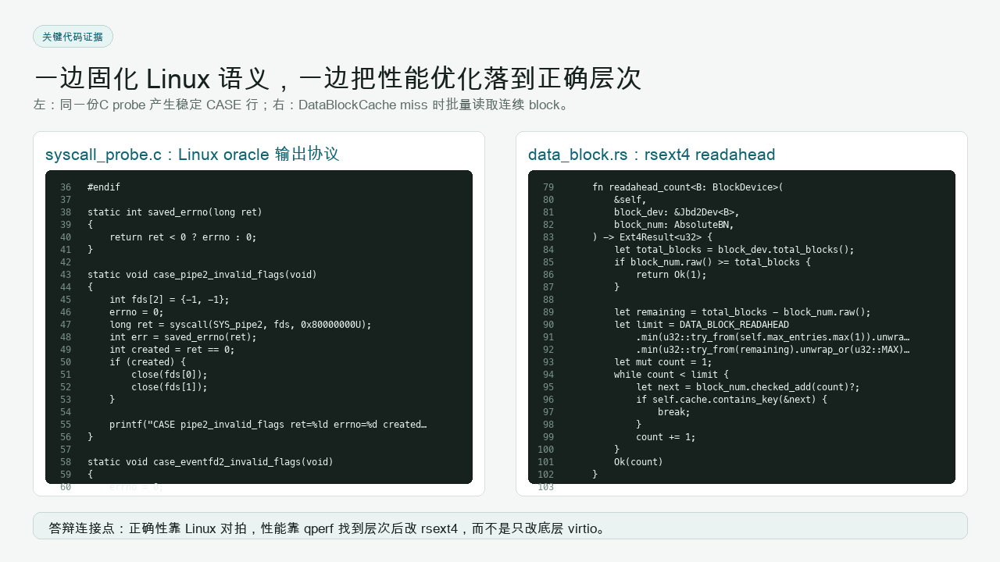

# Task5 细粒度实验报告：OScope Harness、Skill、MCP、UI 与最终交付

## 1. 任务定位

Task5 的目标是把前四个任务的经验沉淀为可复用平台：OScope。它不是单个脚本，而是一套围绕 StarryOS 的证据闭环：

```text
syscall 语义对拍
  -> qperf 性能 profile
  -> A/B compare
  -> Web UI artifact viewer
  -> MCP tools
  -> Codex Skill
  -> OS Knowledge Graph
  -> 报告与 PPT 视觉化表达
```


## 2. 合并的源报告

| 源文件 | 本报告吸收内容 |
| --- | --- |
| `final_pre/harness_implementation_skill_mcp_detail.md` | Skill、MCP、CLI、UI、qperf、artifact 的逐项实现说明 |
| `qperf_harness_work_summary.md` | harness 总体架构、UI/MCP/Knowledge Graph、交付物 |
| `docs/ai-harness-development-framework.md` | AI 自治开发框架与 PR 工作流 |
| `docs/harness-os-knowledge-graph.md` | Knowledge Graph 页面能力与 API |
| `docs/starry-syscall-harness.md` | harness 用户入口 |
| `reports/spin-no-preempt-audit.md`、`reports/external-spin-audit.md`、`reports/external-spin-migration-plan.md` | 后续系统工程治理风险 |

重复合并说明：Skill/MCP/CLI/UI 在多个文档中都有说明，本报告按实现层次重新组织，精确到每个 MCP tool 和每类 artifact。

## 3. 总体架构

OScope 的执行平面：

```text
Codex / Developer / Browser UI
        |
        v
tools/starry-syscall-harness/harness.py
        |
        +-- doctor
        +-- discover
        +-- perf-profile
        +-- perf-postprocess
        +-- perf-diff / perf-compare
        +-- ui
        |
        +-- probes/syscall_probe.c
        +-- tools/qperf
        +-- target/starry-syscall-harness artifacts
        +-- target/qperf artifacts
```

Codex 集成层：

```text
.claude/skills/starry-syscall-harness/SKILL.md
  -> 告诉 agent 何时使用 harness

tools/starry-syscall-harness/mcp_server.py
  -> 将 harness CLI 包装成 MCP tools

tools/starry-syscall-harness/ui_server.py + web/*
  -> 给人工提供本地可视化入口
```

## 4. 本机 no-Docker 运行模式

用户明确要求不拉 Docker，因此本机运行模式做了以下适配：

- Homebrew Python 3.13 作为 harness Python；
- 本机 QEMU 10.2.1 路径优先于 Homebrew QEMU 11；
- `harness.py` 支持 `--no-docker`；
- MCP server 默认注入 `STARRY_SYSCALL_HARNESS_NO_DOCKER=1`；
- qperf dylib 在 macOS 使用 `libqperf.dylib`；
- `scripts/axbuild/src/starry/perf.rs` 使用 `STARRY_SYSCALL_HARNESS_PYTHON` / `PYTHON` 选择 postprocess Python；
- UI 启动命令带 `--no-docker`。

已验证：

| 验证项 | 结果 |
| --- | --- |
| `doctor --no-docker` | required checks 通过，syscall discover 缺 Linux musl 交叉工具链属于已知限制 |
| StarryOS smoke | `cargo xtask starry test qemu --arch riscv64 -c smoke` 通过 |
| qperf no-Docker profile | `perf-profile --no-docker --arch riscv64` 通过 |
| Web UI | `http://127.0.0.1:8765` 可访问，backend mode 为 local |
| Python compile | `harness.py`、`mcp_server.py`、`ui_server.py` 通过 |
| Rust checks | `cargo fmt --all`、`cargo clippy -p axbuild --all-targets` 通过 |

当前限制：`discover --no-docker` 在 macOS 上不能直接编译 Linux oracle probe，因为 Darwin headers 缺少 Linux-only `sys/eventfd.h`，且即使绕过 include 也无法提供 Linux syscall ABI。该路径需要 Linux VM/container 或交叉 Linux sysroot。

## 5. Codex Skill

Skill 文件路径：

```text
.claude/skills/starry-syscall-harness/SKILL.md
```

Codex 本机安装位置：

```text
/Users/chaoge/.codex/skills/starry-syscall-harness
```

Skill 的职责不是执行代码，而是给 agent 提供工作规约：

- 当任务涉及 StarryOS syscall Linux 兼容性时，优先使用 harness discover；
- 当任务涉及性能热点、qperf、virtio、flamegraph 时，优先使用 qperf profile/diff；
- 修复前要建立 Linux oracle 或 qperf baseline；
- 修复后要跑 regression 或 A/B compare；
- 输出需要引用 artifact 路径，而不是只写自然语言结论。

Skill 与 MCP 的关系：

| 层 | 作用 |
| --- | --- |
| Skill | 告诉 agent 应该怎样工作，何时调用工具，如何解释结果 |
| MCP | 把 harness CLI 变成结构化工具调用 |
| CLI | 真正执行 QEMU、qperf、probe、postprocess |

## 6. MCP Server

MCP server 文件：

```text
tools/starry-syscall-harness/mcp_server.py
```

注册命令：

```bash
codex mcp add starry-syscall-harness -- \
  /opt/homebrew/bin/python3.13 \
  /Users/chaoge/workspace/OS/tgoskits/tools/starry-syscall-harness/mcp_server.py \
  --repo /Users/chaoge/workspace/OS/tgoskits
```

实现特征：

- stdio JSON-RPC；
- 自动定位 repo root；
- 使用 `sys.executable` 调用 harness；
- 在 no-Docker 模式下设置 `STARRY_SYSCALL_HARNESS_NO_DOCKER=1`；
- 自动拼接本机 QEMU/qperf/Python 路径；
- 对输出做长度控制，避免 MCP 结果过大；
- 返回结构化 JSON，包含命令、退出码、stdout/stderr 摘要和 artifact 路径。

## 7. MCP Tool 逐项说明

### 7.1 `starry_syscall_doctor`

用途：检查 harness 依赖环境。

主要执行：

```bash
python tools/starry-syscall-harness/harness.py doctor
```

no-Docker 模式下追加：

```bash
--no-docker
```

输出关注：

- Python；
- Cargo/Rust；
- QEMU；
- qperf analyzer；
- Linux 交叉工具链；
- rootfs 工具；
- Docker 或 no-Docker 状态。

在本机环境中，qperf/StarryOS smoke 已可运行；syscall discover 的 Linux oracle 编译仍受 macOS headers 限制。

### 7.2 `starry_syscall_discover`

用途：运行 Linux-vs-StarryOS syscall probe 对拍。

执行链路：

```text
compile Linux probe
  -> run Linux probe
  -> cross compile StarryOS probe
  -> inject rootfs
  -> run StarryOS QEMU
  -> parse CASE lines
  -> compare
  -> report.json / report.md
```

参数通常包括：

- `arch`；
- `timeout`；
- `fail_on_diff`；
- `output_dir`。

当前 no-Docker/macOS 边界：Linux oracle probe 不应使用 Apple clang/Darwin headers 编译。若要完整 discover，需要 Linux 环境或 Linux sysroot。

### 7.3 `starry_perf_profile`

用途：运行 qperf profile 并生成结构化报告。

执行链路：

```text
cargo xtask starry perf / cargo starry perf
  -> QEMU -plugin libqperf
  -> qperf.bin
  -> qperf-analyzer resolve
  -> harness perf-postprocess
  -> report.json / report.md / hotspots.csv / flamegraph.svg
```

常用参数：

- `arch`；
- `timeout`；
- `mode=tb|insn`；
- `format=all|folded|json`；
- `top`；
- `min_percent`；
- `start_marker` / `stop_marker`；
- `shell_init_cmd`；
- `qperf_metrics`；
- `full_stack`。

本机 no-Docker qperf smoke 已通过。

### 7.4 `starry_perf_diff`

用途：比较两份 folded/profile 输出，找出热点差异。

它适合较轻量的 profile 对比；如果有完整 `report.json`，更推荐使用 `perf-compare` CLI 或 UI 中的 compare job。

输出通常包括：

- top function delta；
- sample delta；
- percent delta；
- 差异摘要。

### 7.5 `starry_harness_ui_command`

用途：返回本地 UI 启动命令，而不是直接长期占用 MCP 调用。

典型命令：

```bash
python3 tools/starry-syscall-harness/harness.py ui \
  --no-docker \
  --repo-root /Users/chaoge/workspace/OS/tgoskits \
  --host 127.0.0.1 \
  --port 8765
```

设计原因：UI 是长生命周期服务，MCP tool 应返回命令和参数，让用户或 agent 明确启动，而不是在一次工具调用里无限运行。

## 8. CLI 命令实现

| 命令 | 作用 | 主要产物 |
| --- | --- | --- |
| `doctor` | 环境检查 | stdout 检查表 |
| `discover` | syscall Linux/StarryOS 对拍 | `report.json`、`report.md`、probe stdout |
| `perf-profile` | qperf profile 一次运行 | qperf raw、folded、SVG、JSON、CSV |
| `perf-postprocess` | 从 qperf artifacts 生成 harness report | `report.json`、`hotspots.csv`、`hotspot_categories.csv` |
| `perf-diff` | folded 差异 | diff report |
| `perf-compare` | baseline/candidate A/B compare | `compare.json`、`compare.md`、`compare.csv` |
| `ui` | 本地 Web UI | HTTP service |

这些命令共同保证人工、脚本和 agent 使用同一套事实来源。

## 9. UI 后端

UI server 文件：

```text
tools/starry-syscall-harness/ui_server.py
```

启动：

```bash
python3 tools/starry-syscall-harness/harness.py ui \
  --host 127.0.0.1 \
  --port 8765 \
  --no-docker
```

核心 API：

| Endpoint | 方法 | 功能 |
| --- | --- | --- |
| `/api/status` | GET | repo、mode、报告摘要、job 状态 |
| `/api/jobs` | POST | 启动 doctor/discover/perf-profile/perf-diff |
| `/api/jobs/<id>` | GET | 查看 job 状态和日志 |
| `/api/report?kind=...` | GET | 读取 syscall/perf/diff report |
| `/api/file?path=...` | GET | 读取 artifact |
| `/api/knowledge-graph?...` | GET | 生成或读取 OS 知识图谱 |

安全边界：

- 默认只绑定 `127.0.0.1`；
- 同一时刻只允许一个重型 active job；
- artifact 文件读取限制在 repo 和 harness artifact root 下；
- knowledge graph 扫描根目录限制在当前 repo 或 repo 父目录下；
- request body 和文本字段有长度限制。


## 10. UI 前端

前端文件：

```text
tools/starry-syscall-harness/web/index.html
tools/starry-syscall-harness/web/app.js
```

主要页面：

| 页面 | 功能 |
| --- | --- |
| Status | 显示 backend mode、repo root、最新 report |
| Syscall | 触发 discover，展示 CASE diff |
| Performance | 触发 qperf profile，展示 hotspots、flamegraph、report |
| Diff / Compare | 对比两次 profile |
| Knowledge | 扫描 OS 子系统、代码路径、任务文本和解释节点 |

前端不直接执行 shell，所有执行都通过后端 `/api/jobs`。这避免浏览器侧持有危险命令能力。


## 11. Knowledge Graph

Knowledge Graph 的目标是把代码、报告、任务和 OS 知识点连接起来。它不是替代 qperf 或 syscall probe，而是解释层。

能力：

- 扫描当前仓库或相邻教学仓库；
- 提取 OS 子系统节点；
- 关联代码路径、符号、文档标题和任务文本；
- 生成 coarse/fine 两种粒度；
- 给出 code explanation、OS explanation、coding guidance；
- 让报告和 PPT 能从 artifact viewer 升级为可讲解工作台。

典型节点：

| 节点 | 来源 |
| --- | --- |
| Syscall ABI | `tools/starry-syscall-harness/probes/syscall_probe.c`、StarryOS syscall code |
| VFS / File I/O | Task1 rename、Task2 vectored I/O、Task4 rsext4 |
| VirtIO Block | qperf deep stack、driver counters |
| Procfs / Netlink | Task3 BusyBox |
| Agent Workflow | Skill、MCP、UI、reports |


## 12. Artifact 证据链

OScope 的关键不是“跑过命令”，而是让每次运行留下可审查文件。

syscall discover 产物：

- Linux probe stdout；
- StarryOS probe stdout；
- parsed CASE JSON；
- differences；
- `report.json`；
- `report.md`。

qperf profile 产物：

- `profile.stdout` / `profile.stderr`；
- qperf raw sample；
- `stack.folded`；
- `flamegraph.svg`；
- `resolve.stats.json`；
- `hotspots.csv`；
- `hotspot_categories.csv`；
- `report.json`；
- `report.md`。

A/B compare 产物：

- `compare.json`；
- `compare.md`；
- `compare.csv`。

这些 artifact 是报告、PPT、review 和后续修复的共同事实来源。

## 13. 视觉表达与演示素材

本轮归档将 `final_pre/ppt_assets` 中的视觉素材复制到 `archieve/assets/`，用于 Task4/Task5 报告和最终报告仓库展示。

| 素材 | 用途 |
| --- | --- |
| `01_qperf_baseline_fullstack.png` | baseline 深栈火焰图 |
| `02_qperf_readahead_fullstack.png` | readahead 后深栈火焰图 |
| `03_qperf_blk_focus_flamegraph.png` | blk 聚焦火焰图 |
| `04_harness_ui_syscall.png` | syscall UI |
| `05_harness_ui_performance.png` | performance UI |
| `06_harness_ui_knowledge_graph.png` | knowledge graph UI |
| `07_harness_architecture.png` | harness 架构 |
| `08_ab_compare_metrics.png` | A/B compare 指标 |
| `09_key_code_snippets.png` | 关键代码片段 |



## 14. 系统工程治理与后续风险

`reports/spin-no-preempt-audit.md`、`reports/external-spin-audit.md`、`reports/external-spin-migration-plan.md` 不属于单次 harness 功能，但它们提示了后续维护风险：

- spin lock 与 no-preempt 的使用需要按上下文分类；
- external `spin` crate 依赖应逐步收敛；
- filesystem locks、Starry epoll、tmpfs/VFS cache、netlink receive path 等位置需要持续审计；
- migration 应分阶段，避免一次性替换破坏语义。

这些内容被吸收到 Task5 的后续路线中：OScope 不仅要跑 syscall 和 qperf，还应逐步扩展到锁语义、调度、资源回收和外部依赖治理。

## 15. 当前能力边界

| 边界 | 说明 |
| --- | --- |
| macOS no-Docker syscall discover | Linux oracle probe 需要 Linux headers/syscall ABI，本机 Darwin 不能直接替代 |
| qperf | 是 QEMU TCG plugin，不是 guest PMU |
| marker window | 当前是后处理 timestamp filter，不是 runtime pause/resume |
| callchain | 依赖 frame pointer，trap/任务切换/汇编路径可能截断 |
| counters | driver-visible 近似，不是 ring-level 精确事件 |
| UI | 本地开发工具，默认绑定 localhost，不作为公网服务 |
| MCP | 适合标准化命令入口，不能替代人工 review |

## 16. 最终交付

OScope/harness 已拆分并提交到独立仓库：

```text
cg24-THU/tgoskit-harness_kit
```

已提交内容包括：

- `tools/starry-syscall-harness/`；
- `tools/qperf/`；
- `skills/starry-syscall-harness/SKILL.md`；
- `scripts/install-codex-local.sh`；
- README 与视觉 walkthrough；
- 本机 no-Docker 支持。

当前本机服务运行方式：

```bash
/opt/homebrew/bin/python3.13 \
  tools/starry-syscall-harness/harness.py ui \
  --no-docker \
  --repo-root /Users/chaoge/workspace/OS/tgoskits \
  --host 127.0.0.1 \
  --port 8765
```

## 17. 小结

Task5 的最终价值是把前四个任务变成可复用的 OS 工程平台：

```text
Task1 的分层定位
  + Task2 的 syscall oracle
  + Task3 的真实应用压力测试
  + Task4 的 qperf 证据链
  = OScope harness
```

OScope 让人工和 agent 共用同一套事实：命令、artifact、报告、UI、MCP、Skill 和知识图谱。这比单次修复更重要，因为它把“如何继续改进 StarryOS”变成了可复现流程。
